<div align="center">
   
# Simulación de Anillos Planetarios con el Integrador Leapfrog


Simulación numérica en Python de la dinámica de un **anillo planetario** formado por miles de partículas de prueba que orbitan un planeta con parámetros de Saturno. El proyecto usa el integrador simpléctico **Leapfrog** para estudiar la **estabilidad orbital**, la **conservación de la energía** y el efecto de distintas **distribuciones radiales de densidad** (uniforme, ley de potencia, gaussiana y mixta), además de una **resonancia 2:1** inducida por un satélite.

</div>

> Proyecto final de Física Computacional (2025-2), UNAM.

<p align="center">
  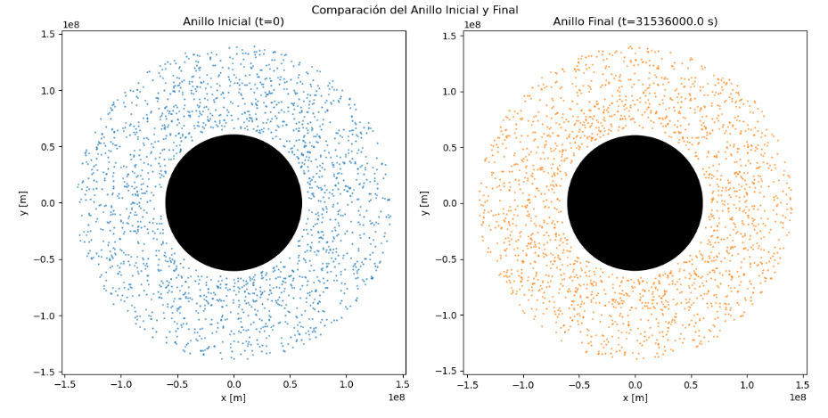
</p>

---

## Contenido

- [Objetivos](#-objetivos)
- [Modelo físico](#-modelo-físico)
- [Método numérico: Leapfrog](#-método-numérico-leapfrog)
- [Resultados](#-resultados)
- [Parámetros de las simulaciones](#-parámetros-de-las-simulaciones)
- [Cómo ejecutarlo](#-cómo-ejecutarlo)
- [Conclusiones](#-conclusiones)
- [Limitaciones y trabajo futuro](#-limitaciones-y-trabajo-futuro)
- [Estructura del repositorio](#-estructura-del-repositorio)
- [Autor y licencia](#-autor-y-licencia)

---

## Objetivos

- Simular la dinámica de un anillo planetario bajo la gravedad del planeta central.
- Validar que Leapfrog **conserva la energía** en integraciones de larga duración.
- Comparar la **estabilidad** del anillo para distintas distribuciones radiales de densidad.
- Analizar cómo cambia la simulación al elegir un **marco de referencia** distinto.
- Observar el efecto de una **resonancia orbital 2:1** provocada por un satélite externo.

## Modelo físico

- **Partículas de prueba:** las partículas del anillo no interactúan gravitacionalmente entre sí; solo responden al potencial del planeta. Se justifica porque la masa del anillo es muy pequeña comparada con la del planeta, y permite simular miles de partículas a un costo computacional razonable.
- **Sistema 2D:** el movimiento ocurre en el plano del anillo.
- **Parámetros de Saturno:** masa del planeta `M = 5.683x10^26 kg`, radio `R = 6.0268x10^7 m`, y un anillo entre `6.6x10^7 m` y `1.4x10^8 m`.
- **Marco inercial centrado en el planeta:** el planteamiento inicial se hizo en un marco rotante (no inercial) con fuerzas centrífuga y de Coriolis. Al introducir distribuciones con grosor, ese enfoque producía anillos inestables, así que se cambió a un marco inercial, donde la única fuerza es la gravedad del planeta:

$$
\ddot{\vec r} = -\frac{G M}{|\vec r|^{3}}\,\vec r
$$

## Método numérico: Leapfrog

Los integradores tipo Runge-Kutta no preservan la energía en integraciones largas, ya que esta crece o decrece con el tiempo y altera la dinámica orbital. **Leapfrog** es un integrador **simpléctico**, así que la energía se mantiene acotada sin derivas. Cada paso sigue el esquema *drift–kick–drift*:

$$
x_{n+\frac12}=x_n+\tfrac{\Delta t}{2}\,v_n,\qquad
v_{n+1}=v_n+\Delta t\,a\!\left(x_{n+\frac12}\right),\qquad
x_{n+1}=x_{n+\frac12}+\tfrac{\Delta t}{2}\,v_{n+1}
$$

Para cada simulación se analizan:

- Configuración del anillo al inicio y al final.
- Diferencia porcentual entre el radio final y el inicial de cada partícula.
- Histograma de las variaciones radiales.
- Variación relativa de la energía total a lo largo del tiempo.

## Resultados

### 1. Validación: anillo circular estable

Un anillo de grosor cero (1000 partículas en `r = 1.2`) con velocidad angular ajustada para equilibrar gravedad y fuerza centrífuga. Tras 100 s de simulación, el anillo final es prácticamente idéntico al inicial, las diferencias de radio quedan por debajo de `5.79x10^-5 %` y la variación relativa de la energía se mantiene por debajo de `10^-11`.

| Anillo inicial vs. final | Variación relativa de la energía |
|:---:|:---:|
| 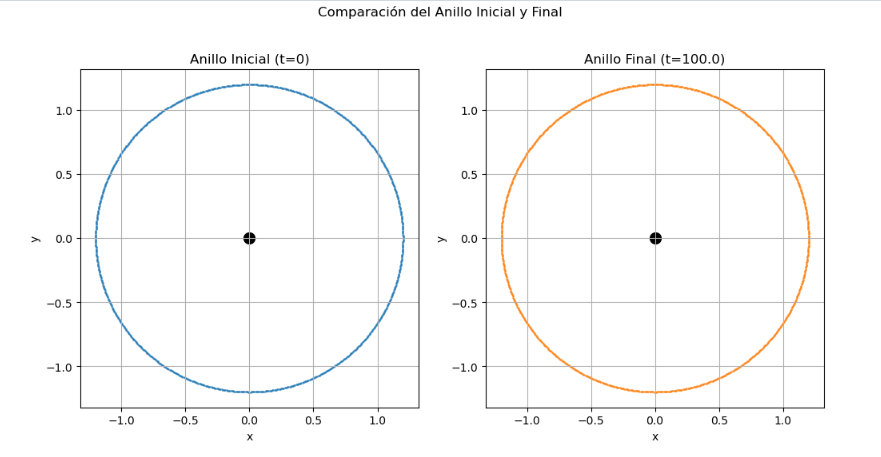 | 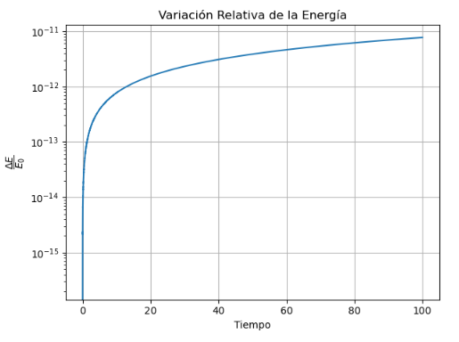 |

### 2. Densidad radial uniforme: el marco de referencia importa

Con partículas distribuidas uniformemente entre `r_in` y `r_out`, el marco rotante produjo un anillo que se destruye: parte de las partículas es expulsada y parte cae hacia el planeta, con variaciones radiales de hasta ~10^6 %. Al replantear el problema en un **marco inercial**, con velocidades circulares `v = √(GM/r)`, el anillo se mantiene estable durante un año de simulación y la mayoría de las partículas varía su radio menos de 3 %.

| Marco rotante (inestable) | Marco inercial (estable) |
|:---:|:---:|
| 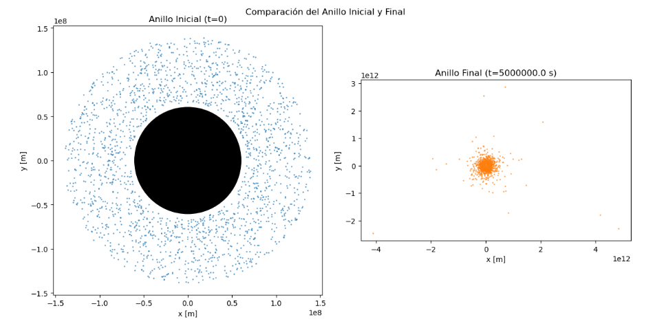 |  |

| Histograma de variaciones radiales | Conservación de la energía |
|:---:|:---:|
| 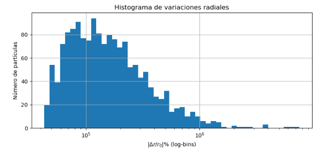 | 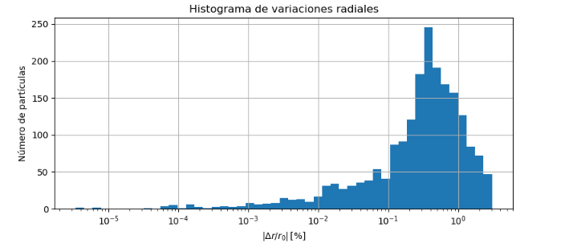 |

### 3. Distribución en ley de potencia

La densidad decrece como una ley de potencia con exponente `p`. Se muestrea con el método de la transformada inversa de la CDF. Cuanto mayor es `p`, más partículas se concentran cerca del planeta: el anillo se mantiene, pero se redistribuye hacia órbitas interiores.

| `p = 1.5` | `p = 9.3` |
|:---:|:---:|
| 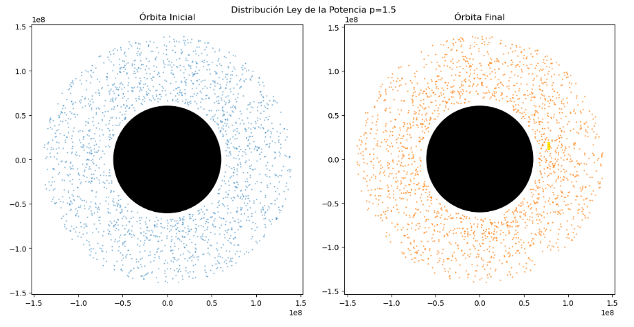 | 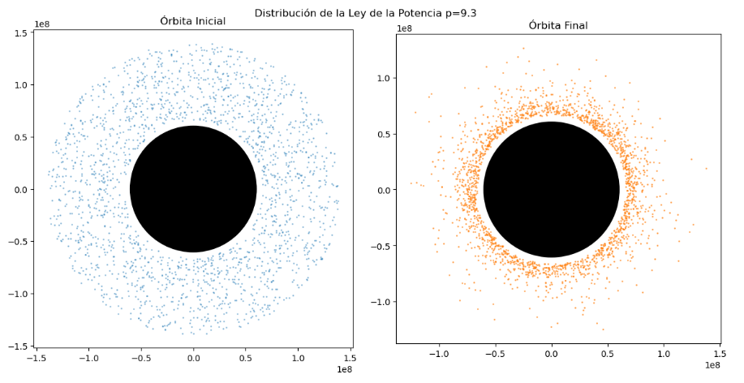 |

También se simuló el caso especial `p = 2`, cuya CDF involucra un logaritmo. Todas las corridas conservan la energía.

### 4. Anillo gaussiano

Concentra las partículas alrededor de un radio central `r_0` con dispersión `σ`, muestreado por rechazo. Se exploró la dependencia con ambos parámetros.

| `r_0 = 1.0x10^8 m`, `σ = 1x10^7 m` | `r_0 = 1.5x10^8 m`, `σ = 1x10^7 m` |
|:---:|:---:|
| 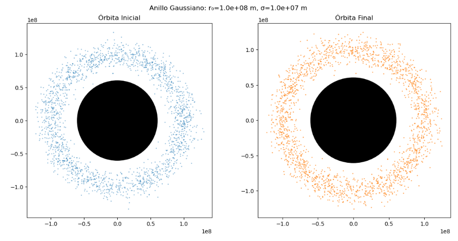 | 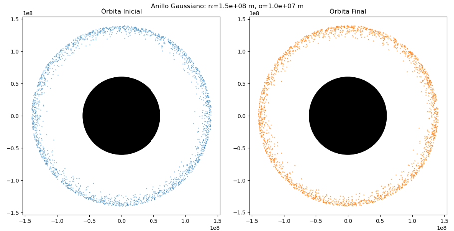 |

### 5. Distribución mixta (ley de potencia + gaussiana)

Combina ambos perfiles para buscar regiones de mayor densidad dentro del mismo anillo, con `r_0 = 1.5x10^8 m` y `σ = 1x10^7 m`.

| `p = 9.5` | `p = 2.3` |
|:---:|:---:|
| 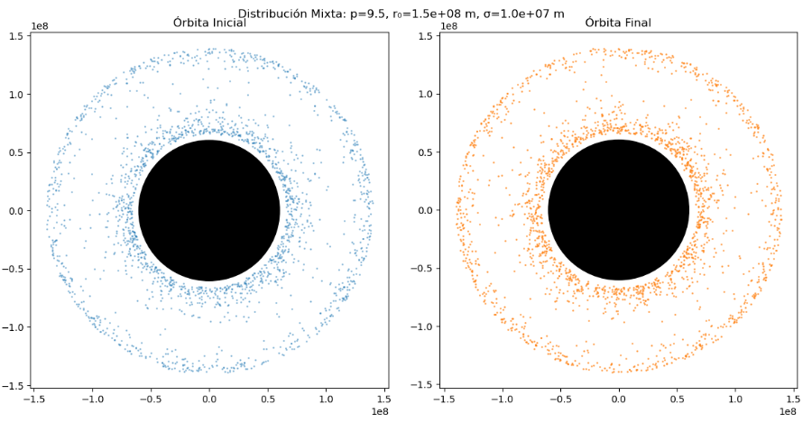 | 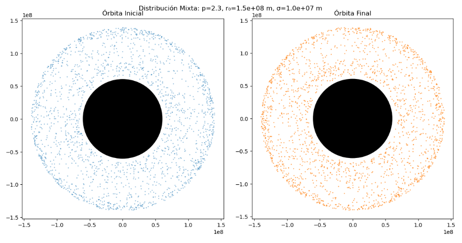 |

### 6. Resonancia 2:1 con un satélite

Se añade un satélite externo (`m = 10^23 kg`, órbita de `2x10^8 m`) y se simulan 10 años. La franja vacía no se aprecia a simple vista en la vista del anillo, pero el **perfil de densidad radial** sí muestra una disminución de partículas en el radio de resonancia, lo que evidencia el fenómeno. El resto del anillo permanece estable y la energía se conserva.

| Anillo inicial vs. final | Perfil de densidad radial final |
|:---:|:---:|
| 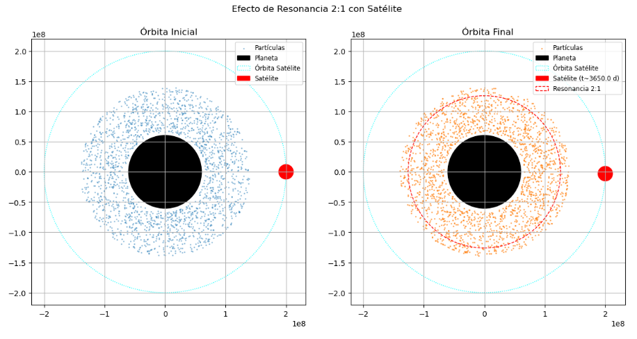 | 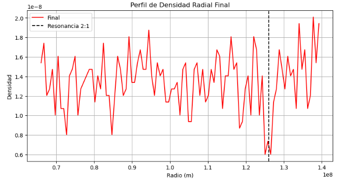 |

> Las gráficas de diferencia porcentual, histogramas y energía de cada caso están en el notebook.

## Parámetros de las simulaciones

| Simulación | Partículas | Paso `dt` | Duración | Marco |
|---|:---:|:---:|:---:|:---:|
| Anillo estable de grosor cero | 1000 | 0.001 (unidades normalizadas) | 100 | Rotante |
| Densidad uniforme (inestable) | 2000 | 10^3 s | 5x10^6 s | Rotante |
| Uniforme, ley de potencia, gaussiana y mixta | 2000 | 10^3 s | 1 año | Inercial |
| Resonancia 2:1 | 2000 | 10^2 s | 10 años | Inercial |

Todos los muestreos usan `np.random.seed(24)` para que los resultados sean reproducibles.

## Cómo ejecutarlo

```bash
# 1. Clonar el repositorio
git clone https://github.com/Edvard-Pichardo/simulacion-orbitas-leapfrog.git
cd simulacion-orbitas-leapfrog

# 2. (Opcional) Crear un entorno virtual
python -m venv venv
source venv/bin/activate        # En Windows: venv\Scripts\activate

# 3. Instalar dependencias
pip install numpy scipy matplotlib jupyter

# 4. Abrir el notebook
jupyter notebook Notebooks/Anillos_Planetarios_Leapfrog.ipynb
```

> La simulación de resonancia (10 años con `dt = 100 s`, más de 3 millones de pasos) es la más pesada del notebook.

---

## Conclusiones

- Leapfrog conserva la energía con variaciones mínimas y acotadas, a diferencia de lo esperado con Runge-Kutta en integraciones largas.
- El **marco de referencia** condiciona el resultado de la simulación. El planteamiento rotante funcionó para un anillo de grosor cero, pero con distribuciones radiales resultó inestable; el marco inercial resolvió el problema.
- Las distribuciones uniforme, de ley de potencia y gaussiana produjeron anillos estables durante un año de simulación. El anillo no es rígido, sino que cada partícula puede cambiar su radio sin caer al planeta ni escapar de él.
- La resonancia 2:1 se manifiesta como una disminución de densidad en el radio de resonancia, aunque la franja vacía no se ve directamente en el tiempo simulado. Se debe simular más tiempo, pero mi equipo con el que trabajé no me permitía hacerlo. 

---

## Limitaciones y trabajo futuro

- Modelo 2D con partículas de prueba (sin autogravedad ni colisiones entre partículas).
- El código puede refactorizarse ya que hay funciones repetidas entre secciones que podrían encapsularse en un módulo reutilizable.
- Optimización del rendimiento (por ejemplo, vectorización adicional o compilación con Numba).
- Extensión a más partículas, a un modelo 3D o a interacciones adicionales.
- Simulaciones más largas para intentar resolver la franja de resonancia.

---

## Estructura del repositorio

```text
.
├── Notebooks/
│   └── Anillos_Planetarios_Leapfrog.ipynb   # Teoría, código y análisis completo
├── images/                                   # Figuras usadas en este README
├── .gitignore
├── LICENSE
└── README.md
```

## Autor y licencia

**Cristian Eduardo Pichardo Rico**
Egresado de la Licenciatura en Física, Facultad de Ciencias, UNAM
GitHub: [@Edvard-Pichardo](https://github.com/Edvard-Pichardo)

Proyecto final de Física Computacional (2025-2). Distribuido bajo la licencia **MIT**; consulta el archivo [LICENSE](LICENSE).
